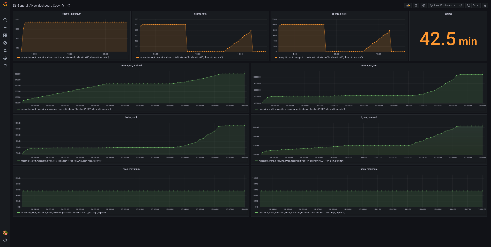

## Prometheus exporter for Mosquitto mqtt broker

[](https://github.com/RizkyRajitha/mosquitto_mqtt_exporter/actions/workflows/publishghrc.yml)
[](https://github.com/RizkyRajitha/mosquitto_mqtt_exporter/actions/workflows/build.yml)
[](https://github.com/RizkyRajitha/mosquitto_mqtt_exporter/actions/workflows/release.yml)

<!-- A Mosquitto Mqtt Broker metric exporter for Prometheus  -->

## Flags

  - `brokerAddress` (required) - mqtt broker ip / url and port (default "127.0.0.1:1883")
  - `listenPort`    (optional) - exporter listening address (default "9992")
  - `password`      (optional) - mqtt password username
  - `username`      (optional) - mqtt broker username

## Run exporter 

### Binary

```bash
./mosquitto_mqtt_exporter --brokerAddress=localhost:1883`
```

### Docker

#### From GHRC
```bash
docker run -d -p 9992:9992 -e brokerAddress=localhost:1883  ghcr.io/rizkyrajitha/mosquitto_mqtt_exporter:latest
```

#### From source
```bash
docker build . --tag=mosquitto_mqtt_exporter

docker run -p 9992:9992 -e brokerAddress=localhost:1883 mosquitto_mqtt_exporter

# with host networking https://stackoverflow.com/a/24326540
docker run -p 9992:9992 --add-host host.docker.internal:host-gateway -e brokerAddress=host.docker.internal:1883  mosquitto_mqtt_exporter

```

## Metrics

|Mosquitto Topic|Prometheus Metric|Description|
|----------------|-----------------|-----------|
$SYS/broker/uptime |mosquitto_uptime| mosquitto broker uptime
$SYS/broker/messages/sent|mosquitto_messages_sent|mosquitto broker messages sent
$SYS/broker/messages/received|mosquitto_messages_received|mosquitto broker messages received
$SYS/broker/clients/total|mosquitto_clients_total|The total number of active and inactive clients currently connected and registered on the broker.
$SYS/broker/clients/maximum|mosquitto_clients_maximum|The maximum number of clients that have been connected to the broker at the same time.
$SYS/broker/clients/active|mosquitto_clients_active|The number of currently connected clients.
$SYS/broker/bytes/sent|mosquitto_bytes_sent|The total number of bytes sent since the broker started.
$SYS/broker/bytes/received|mosquitto_bytes_received|The total number of bytes received since the broker started.
$SYS/broker/heap/current|mosquitto_heap_current|The current size of the heap memory in use by mosquitto. Note that this topic may be unavailable depending on compile time options.
$SYS/broker/heap/maximum|mosquitto_heap_maximum|The largest amount of heap memory used by mosquitto. Note that this topic may be unavailable depending on compile time options.




[mosquitto documentation / ]( https://mosquitto.org/documentation/)
[mosquitto metrics man page ]( https://mosquitto.org/man/mosquitto-8.html)

## Metrics example

```
# HELP mosquitto_mqtt_mosquitto_bytes_received The total number of bytes received since the broker started.
# TYPE mosquitto_mqtt_mosquitto_bytes_received gauge
mosquitto_mqtt_mosquitto_bytes_received 1159
# HELP mosquitto_mqtt_mosquitto_bytes_sent The total number of bytes sent since the broker started.
# TYPE mosquitto_mqtt_mosquitto_bytes_sent gauge
mosquitto_mqtt_mosquitto_bytes_sent 184258
# HELP mosquitto_mqtt_mosquitto_clients_active The number of currently connected clients.
# TYPE mosquitto_mqtt_mosquitto_clients_active gauge
mosquitto_mqtt_mosquitto_clients_active 1
# HELP mosquitto_mqtt_mosquitto_clients_maximum The maximum number of clients that have been connected to the broker at the same time.
# TYPE mosquitto_mqtt_mosquitto_clients_maximum gauge
mosquitto_mqtt_mosquitto_clients_maximum 0
# HELP mosquitto_mqtt_mosquitto_clients_total The total number of active and inactive clients currently connected and registered on the broker.
# TYPE mosquitto_mqtt_mosquitto_clients_total gauge
mosquitto_mqtt_mosquitto_clients_total 1
# HELP mosquitto_mqtt_mosquitto_heap_current The current size of the heap memory in use by mosquitto. Note that this topic may be unavailable depending on compile time options.
# TYPE mosquitto_mqtt_mosquitto_heap_current gauge
mosquitto_mqtt_mosquitto_heap_current 49752
# HELP mosquitto_mqtt_mosquitto_heap_maximum The largest amount of heap memory used by mosquitto. Note that this topic may be unavailable depending on compile time options.
# TYPE mosquitto_mqtt_mosquitto_heap_maximum gauge
mosquitto_mqtt_mosquitto_heap_maximum 0
# HELP mosquitto_mqtt_mosquitto_messages_received mosquitto broker messages received
# TYPE mosquitto_mqtt_mosquitto_messages_received gauge
mosquitto_mqtt_mosquitto_messages_received 96
# HELP mosquitto_mqtt_mosquitto_messages_sent mosquitto broker messages sent
# TYPE mosquitto_mqtt_mosquitto_messages_sent gauge
mosquitto_mqtt_mosquitto_messages_sent 4582
# HELP mosquitto_mqtt_mosquitto_uptime mosquitto broker uptime
# TYPE mosquitto_mqtt_mosquitto_uptime gauge
mosquitto_mqtt_mosquitto_uptime 32802
```

## Build exporter 

```bash
./build.sh
```
Build binaries for following platforms

1. linux/386 
2. linux/amd64
3. linux/arm64" 
4. linux/armv7
5. linux/armv6
6. linux/armv5


<!-- zap logging
 -->
